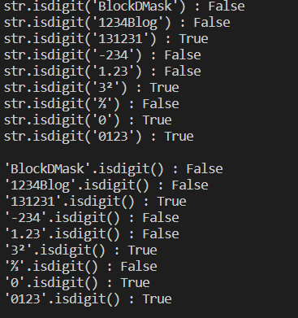

# isdigit 설명
문자열이 '숫자'로만 이루어져 있는지 확인하는 함수입니다.

문자가 '단 하나'라도 있다면 False를 반환하고
모든 문자가 '숫자'로만 이루어져있으면 True를 반환한다.

사용법
1) str.isdigit("판단하고자 하는 문자열")
2) "판단하고자 하는 문자열".isdigit()

두 가지 방법 다 사용이 가능하다

str.isdigit() 은 음수를 뜻하는 '-', 소수점을 뜻하는 '.' 이것들을 숫자가 아닌 문자로 판단을 하기 때문에
실수나 음수를 판단하지 못합니다.

**결과**

